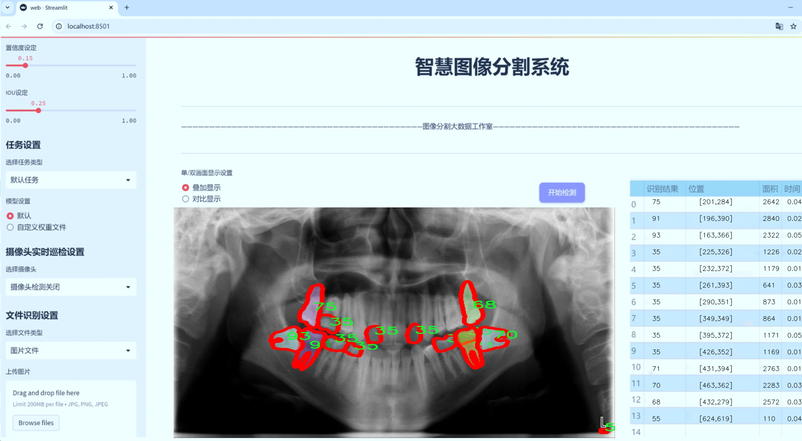
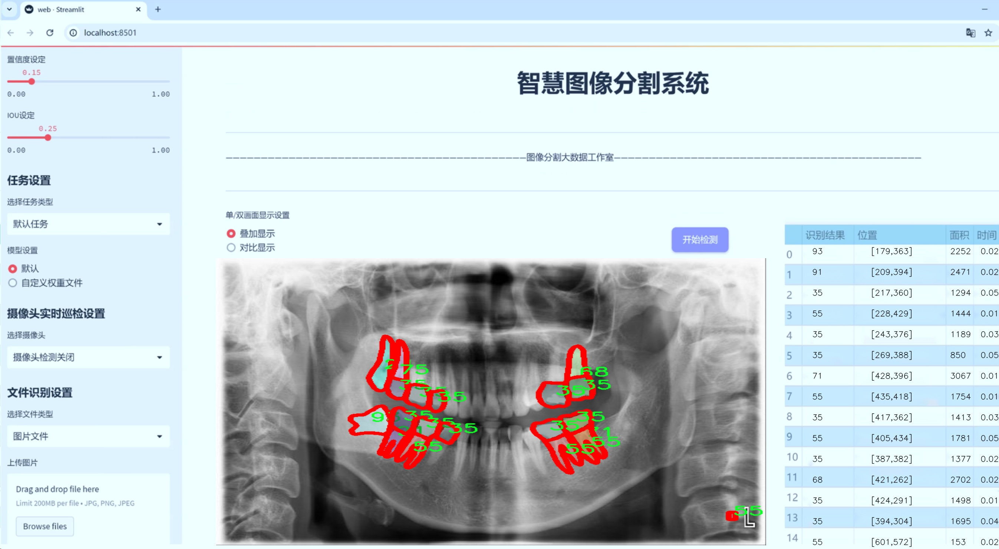
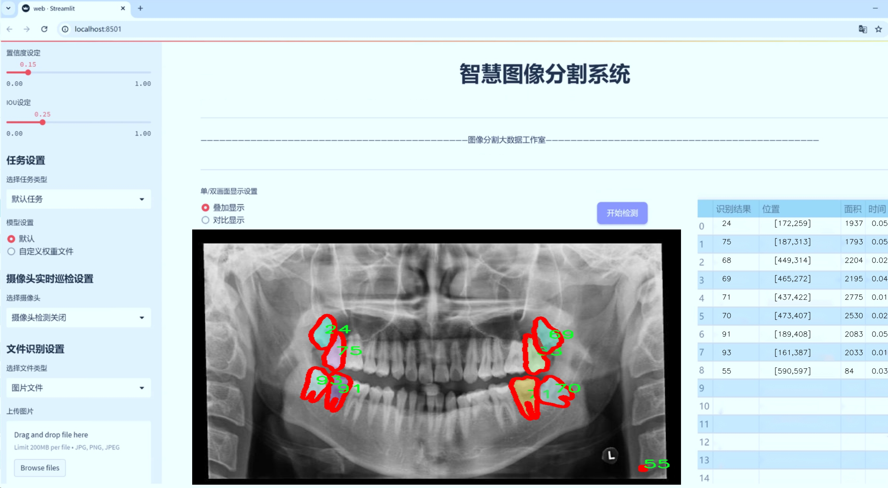
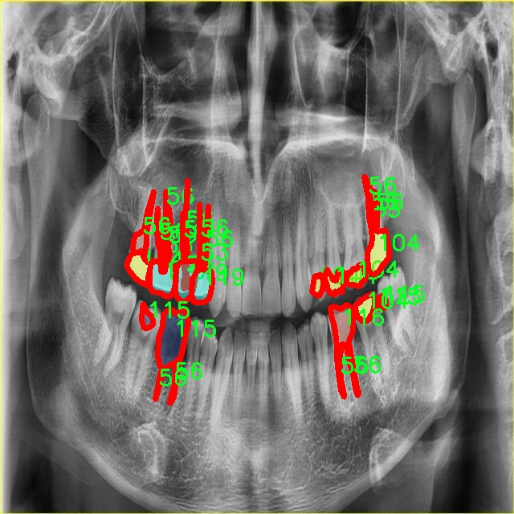
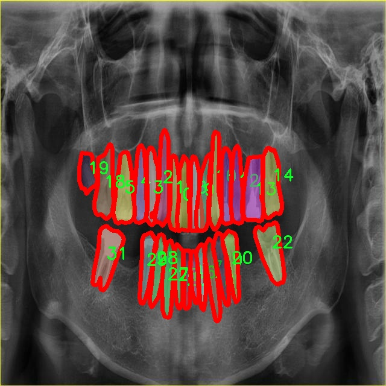
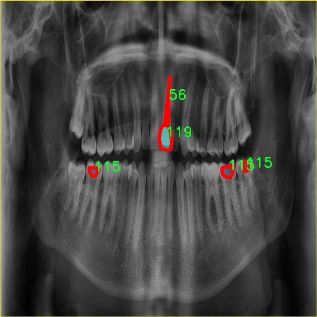
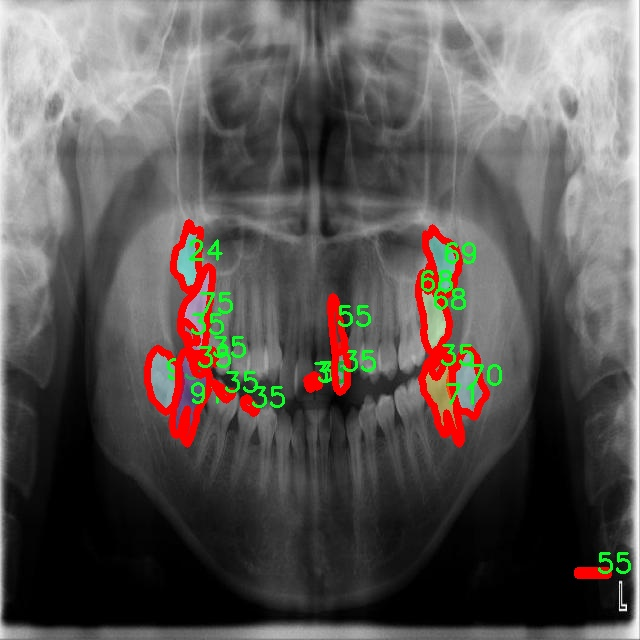
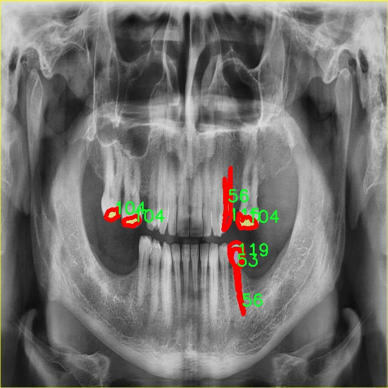

# 牙片图像分割系统源码＆数据集分享
 [yolov8-seg-FocalModulation＆yolov8-seg-ContextGuidedDown等50+全套改进创新点发刊_一键训练教程_Web前端展示]

### 1.研究背景与意义

项目参考[ILSVRC ImageNet Large Scale Visual Recognition Challenge](https://gitee.com/YOLOv8_YOLOv11_Segmentation_Studio/projects)

项目来源[AAAI Global Al lnnovation Contest](https://kdocs.cn/l/cszuIiCKVNis)

研究背景与意义

随着计算机视觉技术的迅猛发展，图像分割在医学影像分析、自动驾驶、智能监控等领域的应用日益广泛。在这些应用中，牙片图像的处理与分析尤为重要，因为牙科诊断的准确性直接影响到患者的治疗效果和口腔健康。因此，开发一种高效、准确的牙片图像分割系统具有重要的临床意义和应用价值。近年来，YOLO（You Only Look Once）系列模型因其高效的实时目标检测能力而受到广泛关注。YOLOv8作为该系列的最新版本，结合了深度学习的先进技术，展现出在多种图像处理任务中的优越性能。

本研究旨在基于改进的YOLOv8模型，构建一个针对牙片图像的分割系统。我们所使用的数据集包含5900张牙片图像，涵盖了122个类别，涉及多种牙齿结构和病变特征。这一丰富的数据集为模型的训练和验证提供了坚实的基础。通过对这些图像进行实例分割，不仅可以实现对牙齿及其周围结构的精确定位，还能帮助牙科医生在诊断过程中更好地识别病变区域，从而提高诊断的准确性和效率。

在当前的研究中，传统的图像分割方法往往依赖于手工特征提取，导致在复杂背景下的分割效果不佳。而基于深度学习的YOLOv8模型通过端到端的学习方式，能够自动提取图像特征，从而显著提升分割的精度和速度。为了进一步提升模型在牙片图像分割任务中的表现，我们将对YOLOv8进行改进，针对牙片图像的特点进行模型结构的优化和参数的调整。这一改进不仅能够提高模型对不同类别牙齿结构的分割能力，还能增强其对噪声和伪影的鲁棒性。

此外，牙片图像的多样性和复杂性为模型的训练带来了挑战。数据集中包含的122个类别涵盖了不同类型的牙齿、牙龈、牙周组织及其病变特征，模型需要具备良好的泛化能力，以适应不同患者的牙片图像。因此，本研究还将探讨数据增强技术的应用，通过扩展训练数据集，提升模型的学习能力和适应性。

综上所述，基于改进YOLOv8的牙片图像分割系统的研究，不仅具有重要的理论意义，也为临床牙科诊断提供了新的技术支持。通过提高牙片图像的分割精度和效率，能够为牙科医生提供更为准确的诊断依据，进而改善患者的治疗效果和口腔健康。随着研究的深入，期待这一系统能够在实际应用中发挥重要作用，推动牙科影像学的发展。

### 2.图片演示







##### 注意：由于此博客编辑较早，上面“2.图片演示”和“3.视频演示”展示的系统图片或者视频可能为老版本，新版本在老版本的基础上升级如下：（实际效果以升级的新版本为准）

  （1）适配了YOLOV8的“目标检测”模型和“实例分割”模型，通过加载相应的权重（.pt）文件即可自适应加载模型。

  （2）支持“图片识别”、“视频识别”、“摄像头实时识别”三种识别模式。

  （3）支持“图片识别”、“视频识别”、“摄像头实时识别”三种识别结果保存导出，解决手动导出（容易卡顿出现爆内存）存在的问题，识别完自动保存结果并导出到tempDir中。

  （4）支持Web前端系统中的标题、背景图等自定义修改，后面提供修改教程。

  另外本项目提供训练的数据集和训练教程,暂不提供权重文件（best.pt）,需要您按照教程进行训练后实现图片演示和Web前端界面演示的效果。

### 3.视频演示

[3.1 视频演示](https://www.bilibili.com/video/BV1ZuyVYJE7Q/)

### 4.数据集信息展示

##### 4.1 本项目数据集详细数据（类别数＆类别名）

nc: 122
names: ['0', '1', '10', '100', '101', '102', '103', '104', '105', '106', '107', '108', '109', '11', '110', '111', '112', '113', '114', '115', '116', '117', '118', '119', '12', '120', '121', '13', '14', '15', '16', '17', '18', '19', '2', '20', '21', '22', '23', '24', '25', '26', '27', '28', '29', '3', '30', '31', '32', '33', '34', '35', '36', '37', '38', '39', '4', '40', '41', '42', '43', '44', '45', '46', '47', '48', '49', '5', '50', '51', '52', '53', '54', '55', '56', '57', '58', '59', '6', '60', '61', '62', '63', '64', '65', '66', '67', '68', '69', '7', '70', '71', '72', '73', '74', '75', '76', '77', '78', '79', '8', '80', '81', '82', '83', '84', '85', '86', '87', '88', '89', '9', '90', '91', '92', '93', '94', '95', '96', '97', '98', '99']


##### 4.2 本项目数据集信息介绍

数据集信息展示

在本研究中，我们采用了名为“period”的数据集，以训练和改进YOLOv8-seg模型，专注于牙片图像的分割任务。该数据集包含122个类别，涵盖了从简单到复杂的多种牙片特征，旨在为模型提供丰富的训练样本，以提高其在实际应用中的准确性和鲁棒性。

“period”数据集的类别列表包括从‘0’到‘99’的数字，以及一些更高的数字，如‘100’到‘122’。这些类别的命名方式相对简单，采用数字编码的形式，反映了牙片图像中不同特征的多样性。这种分类方式使得模型能够在训练过程中学习到不同类别之间的细微差别，从而在进行图像分割时，能够更精准地识别和分离出各个特征。

数据集的设计考虑到了牙片图像的复杂性和多样性。牙片作为一种重要的医学影像，常常包含多种结构和特征，例如牙齿、牙龈、牙周组织等。通过将这些特征细分为122个类别，研究人员能够更好地捕捉到牙片图像中的重要信息。这种细致的分类不仅提高了模型的分割能力，也为后续的临床分析提供了更为精准的数据支持。

在数据集的构建过程中，研究团队可能采用了多种数据采集和标注技术，以确保每个类别的样本数量和质量。数据集中的每一张图像都经过精心标注，确保模型在训练时能够接收到准确的信息。这种高质量的标注对于深度学习模型的训练至关重要，因为它直接影响到模型的学习效果和最终的预测能力。

此外，数据集的多样性也体现在样本的来源和类型上。不同的牙片图像可能来自于不同的患者，具有不同的拍摄条件和成像质量。这种多样性不仅增强了模型的泛化能力，也使得模型在面对现实世界中的各种情况时，能够表现得更加稳健。

在进行YOLOv8-seg模型的训练时，研究人员将利用“period”数据集中的122个类别进行多轮次的训练和验证。通过不断调整模型参数和优化算法，期望能够在牙片图像分割任务中取得显著的性能提升。最终，研究团队希望通过这一改进的分割系统，能够为牙科医生提供更为准确的诊断工具，进而提高患者的治疗效果。

综上所述，“period”数据集不仅为本研究提供了丰富的训练素材，也为牙片图像分割技术的发展奠定了坚实的基础。通过对该数据集的深入分析和应用，研究团队将致力于推动牙科影像学的进步，为临床实践带来更大的价值。











### 5.全套项目环境部署视频教程（零基础手把手教学）

[5.1 环境部署教程链接（零基础手把手教学）](https://www.bilibili.com/video/BV1jG4Ve4E9t/?vd_source=bc9aec86d164b67a7004b996143742dc)


[5.2 安装Python虚拟环境创建和依赖库安装视频教程链接（零基础手把手教学）](https://www.bilibili.com/video/BV1nA4VeYEze/?vd_source=bc9aec86d164b67a7004b996143742dc)

### 6.手把手YOLOV8-seg训练视频教程（零基础小白有手就能学会）

[6.1 手把手YOLOV8-seg训练视频教程（零基础小白有手就能学会）](https://www.bilibili.com/video/BV1cA4VeYETe/?vd_source=bc9aec86d164b67a7004b996143742dc)


按照上面的训练视频教程链接加载项目提供的数据集，运行train.py即可开始训练



     Epoch   gpu_mem       box       obj       cls    labels  img_size
     1/200     0G   0.01576   0.01955  0.007536        22      1280: 100%|██████████| 849/849 [14:42<00:00,  1.04s/it]
               Class     Images     Labels          P          R     mAP@.5 mAP@.5:.95: 100%|██████████| 213/213 [01:14<00:00,  2.87it/s]
                 all       3395      17314      0.994      0.957      0.0957      0.0843

     Epoch   gpu_mem       box       obj       cls    labels  img_size
     2/200     0G   0.01578   0.01923  0.007006        22      1280: 100%|██████████| 849/849 [14:44<00:00,  1.04s/it]
               Class     Images     Labels          P          R     mAP@.5 mAP@.5:.95: 100%|██████████| 213/213 [01:12<00:00,  2.95it/s]
                 all       3395      17314      0.996      0.956      0.0957      0.0845

     Epoch   gpu_mem       box       obj       cls    labels  img_size
     3/200     0G   0.01561    0.0191  0.006895        27      1280: 100%|██████████| 849/849 [10:56<00:00,  1.29it/s]
               Class     Images     Labels          P          R     mAP@.5 mAP@.5:.95: 100%|███████   | 187/213 [00:52<00:00,  4.04it/s]
                 all       3395      17314      0.996      0.957      0.0957      0.0845


### 7.50+种全套YOLOV8-seg创新点代码加载调参视频教程（一键加载写好的改进模型的配置文件）

[7.1 50+种全套YOLOV8-seg创新点代码加载调参视频教程（一键加载写好的改进模型的配置文件）](https://www.bilibili.com/video/BV1Hw4VePEXv/?vd_source=bc9aec86d164b67a7004b996143742dc)

### 8.YOLOV8-seg图像分割算法原理

原始YOLOV8-seg算法原理

YOLOv8-seg算法是目标检测和分割领域的一个重要进展，结合了YOLO系列算法的优越性与图像分割的精细化需求。作为YOLO系列的最新版本，YOLOv8-seg不仅在目标检测上取得了显著的提升，同时也在图像分割任务中展现出卓越的性能。其核心思想在于通过高效的特征提取与处理机制，实现对复杂场景中目标的精准定位与分割。

YOLOv8-seg算法的架构主要由三个部分组成：Backbone、Neck和Head。Backbone负责特征提取，采用了CSPDarknet结构，这种结构通过跨级连接的方式，能够有效地增强特征的表达能力。具体而言，CSPDarknet将输入特征图分为多个分支，每个分支经过独立的卷积处理后再进行融合，这种设计不仅提高了特征的多样性，还增强了梯度流动，避免了信息的丢失。相较于YOLOv5中的C3模块，YOLOv8-seg引入了更为轻量化的C2f模块，这一模块通过分支的方式进行特征的降维和融合，进一步提升了特征提取的效率。

在特征提取之后，YOLOv8-seg算法采用了快速空间金字塔池化（SPPF）结构，这一结构能够有效地提取不同尺度的特征，并且在参数量和计算量上进行了优化。SPPF通过并行处理不同尺度的特征图，确保了模型在处理多尺度目标时的灵活性与准确性。这种设计使得YOLOv8-seg能够在面对复杂场景时，依然保持高效的特征提取能力。

Neck部分则使用了特征金字塔网络（FPN）和路径聚合网络（PAN）的组合，这一结构通过多层次的特征融合与信息传递，进一步提升了模型对目标的感知能力。FPN能够有效地处理不同层次的特征图，确保了从粗到细的特征信息都能被充分利用。而PAN则通过增强特征图之间的连接，确保了信息的流动性，使得模型在进行目标检测与分割时，能够更好地捕捉到目标的边界信息。

在Head部分，YOLOv8-seg采用了无锚框（Anchor-Free）的检测方式，这一创新设计使得模型能够直接预测目标的中心点及其宽高比例，避免了传统锚框方法带来的复杂性与局限性。这种方式不仅提高了检测的速度，还在准确度上有了显著提升。此外，YOLOv8-seg还引入了新的损失策略，包括变焦损失、数据平均保真度损失和完美交并比损失等，这些损失函数的设计使得模型在训练过程中能够更好地优化目标检测与分割的性能。

YOLOv8-seg在图像分割任务中的表现尤为突出，其通过对目标边界的精细化处理，实现了对目标的高质量分割。算法通过对特征图的逐层处理，结合上下文信息，能够有效地分辨出目标的边界与背景。这一能力在实际应用中，尤其是在复杂场景下的目标检测与分割任务中，展现出了巨大的潜力。

此外，YOLOv8-seg在多尺度训练与测试方面的优化，使得模型在不同尺寸的输入图像上均能保持较高的检测与分割精度。这一特性使得YOLOv8-seg能够广泛应用于各种实际场景，如智能监控、自动驾驶、医学影像分析等领域。

综上所述，YOLOv8-seg算法通过一系列创新的设计与优化，不仅提升了目标检测的准确性与速度，还在图像分割任务中展现出了强大的能力。其高效的特征提取、灵活的结构设计以及先进的损失策略，使得YOLOv8-seg成为当前目标检测与分割领域中的一项重要技术，推动了相关研究与应用的发展。随着技术的不断进步，YOLOv8-seg有望在更多复杂场景中发挥其优势，为各类智能应用提供更为精准的支持。


### 9.系统功能展示（检测对象为举例，实际内容以本项目数据集为准）

图9.1.系统支持检测结果表格显示

  图9.2.系统支持置信度和IOU阈值手动调节

  图9.3.系统支持自定义加载权重文件best.pt(需要你通过步骤5中训练获得)

  图9.4.系统支持摄像头实时识别

  图9.5.系统支持图片识别

  图9.6.系统支持视频识别

  图9.7.系统支持识别结果文件自动保存

  图9.8.系统支持Excel导出检测结果数据


### 10.50+种全套YOLOV8-seg创新点原理讲解（非科班也可以轻松写刊发刊，V11版本正在科研待更新）

#### 10.1 由于篇幅限制，每个创新点的具体原理讲解就不一一展开，具体见下列网址中的创新点对应子项目的技术原理博客网址【Blog】：


[10.1 50+种全套YOLOV8-seg创新点原理讲解链接](https://gitee.com/qunmasj/good)

#### 10.2 部分改进模块原理讲解(完整的改进原理见上图和技术博客链接)【如果此小节的图加载失败可以通过CSDN或者Github搜索该博客的标题访问原始博客，原始博客图片显示正常】
### 全维动态卷积ODConv
鉴于上述讨论，我们的ODConv引入了一种多维注意机制，该机制具有并行策略，用于学习卷积核在核空间的所有四个维度上的不同注意。图提供了CondConv、DyConv和ODConv的示意性比较。

ODConv的公式：根据等式1中的符号，ODConv可定义为


 将注意力标量分配给整个卷积核。图2示出了将这四种类型的关注乘以n个卷积核的过程。原则上，这四种类型的关注是相互补充的，并且以位置、信道、滤波器和核的顺序将它们逐步乘以卷积核 
 ，使得卷积运算不同w.r.t.所有空间位置、所有输入信道、所有滤波器和输入x的所有核，提供捕获丰富上下文线索的性能保证。因此，ODConv可以显著增强CNN基本卷积运算的特征提取能力。此外，具有单个卷积核的ODConv可以与标准CondConv和DyConv竞争或优于它们，为最终模型引入的额外参数大大减少。提供了大量实验来验证这些优点。通过比较等式1和等式2，我们可以清楚地看到，ODConv是一种更广义的动态卷积。此外，当设置n=1且 所有分量均为1时，只关注滤波器方向 的ODConv将减少为：将基于输入特征的SE变量应用于卷积滤波器，然后进行卷积运算（注意原始SE（Hu等人，2018b）基于输出特征，并且用于重新校准输出特征本身）。这种SE变体是ODConv的特例。


图：将ODConv中的四种注意类型逐步乘以卷积核的示例。（a） 沿空间维度的逐位置乘法运算，（b）沿输入信道维度的逐信道乘法运算、（c）沿输出信道维度的按滤波器乘法运算，以及（d）沿卷积核空间的核维度的按核乘法运算。方法部分对符号进行了说明
实现：对于ODConv，一个关键问题是如何计算卷积核的四种关注度 。继CondConv和DyConv之后，我们还使用SE型注意力模块（Hu等人，2018b），但将多个头部作为来计算它们，其结构如图所示。具体而言，首先通过逐通道全局平均池（GAP）运算将输入压缩到具有长度的特征向量中。随后，存在完全连接（FC）层和四个头部分支。ReLU（Krizhevsky等人，2012）位于FC层之后。FC层将压缩特征向量映射到具有缩减比的低维空间（根据消融实验，我们在所有主要实验中设置 ，避免了高模型复杂度）。对于四个头部分支，每个分支都有一个输出大小如图。

### 引入ODConv的改进YOLO
参考这篇博客涵盖了引入ODConv的改进YOLOv8系统的内容，ODConv采用多维注意机制，在卷积核空间的四个维度上学习不同的注意。结合了CondConv和DyConv的优势，ODConv通过图示的四种注意类型逐步与卷积核相乘，以捕获丰富的上下文线索，提升特征提取能力。

#### ODConv结构与方法
ODConv的公式和图示展示了其关注力分配给卷积核的方式，其中四种类型的关注以位置、信道、滤波器和核的顺序逐步与卷积核相乘。这种结构保证了卷积运算不同于标准的Conv操作，能够捕获更多上下文信息，从而增强了CNN的特征提取能力。另外，单个卷积核的ODConv在性能上能够与CondConv和DyConv相竞争，并且引入的额外参数大幅减少。

ODConv的特殊之处在于其广义的动态卷积性质，同时在特定条件下（n=1且所有分量为1），它可以退化为一种特例，即只关注滤波器方向，这类似于基于输入特征的SE变体，但不同于原始SE，它基于输出特征。

#### ODConv的实现
关键问题在于如何计算卷积核的四种关注度。ODConv采用了SE型注意力模块，结合了多个头部来计算这些关注度。具体实现上，通过逐通道全局平均池运算和完全连接层，将输入压缩为特征向量，随后使用四个头部分支来计算四种不同类型的关注。这样的结构能在保持模型复杂度可控的情况下，提升了特征的表征能力。

ODConv的引入为YOLOv8带来了显著的性能提升，并且通过大量实验证明了其在特征提取方面的优越性。其结合了多维注意机制和卷积操作，为目标检测和分拣系统的提升带来了新的思路和性能突破。


### 11.项目核心源码讲解（再也不用担心看不懂代码逻辑）

#### 11.1 ultralytics\utils\callbacks\hub.py

以下是对给定代码的核心部分进行提炼和详细注释的结果：

```python
# Ultralytics YOLO 🚀, AGPL-3.0 license

import json
from time import time
from ultralytics.hub.utils import HUB_WEB_ROOT, PREFIX, events
from ultralytics.utils import LOGGER, SETTINGS

def on_fit_epoch_end(trainer):
    """在每个训练周期结束时上传训练进度指标。"""
    session = getattr(trainer, 'hub_session', None)  # 获取训练会话
    if session:
        # 收集训练损失和指标
        all_plots = {**trainer.label_loss_items(trainer.tloss, prefix='train'), **trainer.metrics}
        # 如果是第一个周期，添加模型信息
        if trainer.epoch == 0:
            from ultralytics.utils.torch_utils import model_info_for_loggers
            all_plots = {**all_plots, **model_info_for_loggers(trainer)}
        
        # 将指标序列化为JSON并存入队列
        session.metrics_queue[trainer.epoch] = json.dumps(all_plots)
        
        # 检查是否超过上传速率限制
        if time() - session.timers['metrics'] > session.rate_limits['metrics']:
            session.upload_metrics()  # 上传指标
            session.timers['metrics'] = time()  # 重置计时器
            session.metrics_queue = {}  # 重置队列

def on_model_save(trainer):
    """在模型保存时上传检查点，遵循速率限制。"""
    session = getattr(trainer, 'hub_session', None)  # 获取训练会话
    if session:
        is_best = trainer.best_fitness == trainer.fitness  # 判断当前模型是否是最佳模型
        # 检查是否超过上传速率限制
        if time() - session.timers['ckpt'] > session.rate_limits['ckpt']:
            LOGGER.info(f'{PREFIX}上传检查点 {HUB_WEB_ROOT}/models/{session.model_id}')
            session.upload_model(trainer.epoch, trainer.last, is_best)  # 上传模型
            session.timers['ckpt'] = time()  # 重置计时器

def on_train_end(trainer):
    """在训练结束时上传最终模型和指标到Ultralytics HUB。"""
    session = getattr(trainer, 'hub_session', None)  # 获取训练会话
    if session:
        LOGGER.info(f'{PREFIX}同步最终模型...')
        # 上传最终模型和指标
        session.upload_model(trainer.epoch, trainer.best, map=trainer.metrics.get('metrics/mAP50-95(B)', 0), final=True)
        session.alive = False  # 停止心跳
        LOGGER.info(f'{PREFIX}完成 ✅\n'
                    f'{PREFIX}查看模型在 {HUB_WEB_ROOT}/models/{session.model_id} 🚀')

# 定义回调函数字典
callbacks = {
    'on_fit_epoch_end': on_fit_epoch_end,
    'on_model_save': on_model_save,
    'on_train_end': on_train_end,
} if SETTINGS['hub'] is True else {}  # 验证是否启用
```

### 代码核心部分说明：
1. **on_fit_epoch_end**: 该函数在每个训练周期结束时被调用，用于收集并上传训练过程中的指标。它会检查是否超过了上传速率限制，并在合适的时机上传数据。

2. **on_model_save**: 该函数在模型保存时被调用，负责上传模型的检查点。它同样遵循速率限制，确保不会过于频繁地上传数据。

3. **on_train_end**: 该函数在训练结束时被调用，负责上传最终的模型和训练指标，并记录相关信息。

4. **callbacks**: 这是一个字典，包含了不同训练阶段的回调函数，仅在设置启用时被定义。

### 注释说明：
- 每个函数都有明确的文档字符串，描述其功能。
- 关键操作和逻辑都有详细的注释，便于理解代码的执行流程和目的。

这个文件是一个用于Ultralytics YOLO项目的回调函数模块，主要负责在训练、验证和预测过程中与Ultralytics HUB进行交互。文件中定义了一系列的回调函数，这些函数在特定事件发生时被调用，以便记录训练进度、上传模型和指标等。

首先，文件导入了一些必要的库和模块，包括`json`和`time`，以及Ultralytics HUB的相关工具和日志记录器。接着，定义了一些回调函数。

`on_pretrain_routine_end`函数在预训练例程结束时被调用。它的主要功能是记录模型的查看链接，并开始一个计时器，用于限制上传速率。

`on_fit_epoch_end`函数在每个训练周期结束时被调用。它会上传训练进度的指标，包括损失和其他性能指标。如果是第一个周期，还会记录模型的信息。该函数会检查上传的时间间隔，以确保不超过速率限制。

`on_model_save`函数在模型保存时被调用。它会根据速率限制上传模型的检查点，并判断当前模型是否是最佳模型。

`on_train_end`函数在训练结束时被调用。它会上传最终的模型和指标，并停止心跳信号的发送，以表示训练的完成。

`on_train_start`、`on_val_start`、`on_predict_start`和`on_export_start`函数分别在训练、验证、预测和导出开始时被调用，主要是执行与这些事件相关的操作。

最后，所有的回调函数被组织成一个字典`callbacks`，如果设置中启用了hub功能，则将这些回调函数添加到字典中，以便在相应的事件发生时调用。

总体来说，这个文件的目的是为了方便在Ultralytics YOLO的训练过程中与HUB进行交互，记录和上传训练过程中的重要信息。

#### 11.2 ultralytics\engine\predictor.py

以下是代码中最核心的部分，并附上详细的中文注释：

```python
class BasePredictor:
    """
    BasePredictor类。

    这是一个用于创建预测器的基类。

    属性:
        args (SimpleNamespace): 预测器的配置。
        save_dir (Path): 保存结果的目录。
        done_warmup (bool): 预测器是否完成初始化。
        model (nn.Module): 用于预测的模型。
        data (dict): 数据配置。
        device (torch.device): 用于预测的设备。
        dataset (Dataset): 用于预测的数据集。
    """

    def __init__(self, cfg=DEFAULT_CFG, overrides=None, _callbacks=None):
        """
        初始化BasePredictor类。

        参数:
            cfg (str, optional): 配置文件的路径。默认为DEFAULT_CFG。
            overrides (dict, optional): 配置覆盖。默认为None。
        """
        self.args = get_cfg(cfg, overrides)  # 获取配置
        self.save_dir = get_save_dir(self.args)  # 获取保存目录
        if self.args.conf is None:
            self.args.conf = 0.25  # 默认置信度为0.25
        self.done_warmup = False  # 初始化状态
        self.model = None  # 模型初始化为None
        self.data = self.args.data  # 数据配置
        self.imgsz = None  # 图像大小
        self.device = None  # 设备
        self.dataset = None  # 数据集
        self.results = None  # 预测结果
        self.callbacks = _callbacks or callbacks.get_default_callbacks()  # 回调函数

    def preprocess(self, im):
        """
        在推理之前准备输入图像。

        参数:
            im (torch.Tensor | List(np.ndarray)): 输入图像，BCHW格式的张量或[(HWC) x B]格式的列表。
        """
        not_tensor = not isinstance(im, torch.Tensor)  # 检查输入是否为张量
        if not_tensor:
            im = np.stack(self.pre_transform(im))  # 预处理图像
            im = im[..., ::-1].transpose((0, 3, 1, 2))  # 将BGR转换为RGB，调整维度
            im = np.ascontiguousarray(im)  # 确保数组是连续的
            im = torch.from_numpy(im)  # 转换为张量

        im = im.to(self.device)  # 将图像移动到指定设备
        im = im.half() if self.model.fp16 else im.float()  # 转换数据类型
        if not_tensor:
            im /= 255  # 将像素值从0-255归一化到0.0-1.0
        return im

    def inference(self, im, *args, **kwargs):
        """对给定图像进行推理。"""
        return self.model(im, augment=self.args.augment)  # 使用模型进行推理

    def __call__(self, source=None, model=None, stream=False, *args, **kwargs):
        """对图像或流进行推理。"""
        self.stream = stream
        if stream:
            return self.stream_inference(source, model, *args, **kwargs)  # 实时推理
        else:
            return list(self.stream_inference(source, model, *args, **kwargs))  # 合并结果

    def stream_inference(self, source=None, model=None, *args, **kwargs):
        """对摄像头输入进行实时推理并将结果保存到文件。"""
        if not self.model:
            self.setup_model(model)  # 设置模型

        self.setup_source(source if source is not None else self.args.source)  # 设置数据源

        # 预热模型
        if not self.done_warmup:
            self.model.warmup(imgsz=(1, 3, *self.imgsz))  # 预热模型
            self.done_warmup = True

        for batch in self.dataset:  # 遍历数据集
            path, im0s, vid_cap, s = batch  # 获取当前批次的路径、图像和视频捕获对象

            im = self.preprocess(im0s)  # 预处理图像
            preds = self.inference(im, *args, **kwargs)  # 进行推理
            self.results = self.postprocess(preds, im, im0s)  # 后处理结果

            for i in range(len(im0s)):
                p, im0 = path[i], im0s[i].copy()  # 获取当前图像路径和图像
                self.write_results(i, self.results, (p, im, im0))  # 写入结果

            yield from self.results  # 生成结果

    def setup_model(self, model, verbose=True):
        """使用给定参数初始化YOLO模型并设置为评估模式。"""
        self.model = AutoBackend(model or self.args.model, device=select_device(self.args.device, verbose=verbose))
        self.device = self.model.device  # 更新设备
        self.model.eval()  # 设置模型为评估模式

    def write_results(self, idx, results, batch):
        """将推理结果写入文件或目录。"""
        p, im, _ = batch
        result = results[idx]  # 获取当前结果
        # 处理保存逻辑...
```

### 代码核心部分解释
1. **BasePredictor类**：这是整个预测流程的核心类，负责初始化、预处理、推理和后处理等步骤。
2. **预处理方法**：`preprocess`方法负责将输入图像转换为模型所需的格式，包括数据类型转换和归一化。
3. **推理方法**：`inference`方法使用加载的模型对预处理后的图像进行推理。
4. **流推理方法**：`stream_inference`方法处理实时视频流的推理，能够逐帧处理视频并生成结果。
5. **模型设置**：`setup_model`方法负责加载和初始化YOLO模型，并设置为评估模式。
6. **结果写入**：`write_results`方法负责将推理结果保存到指定的文件或目录中。

以上是代码的核心部分及其详细注释，涵盖了YOLO模型推理的主要流程。

这个程序文件是Ultralytics YOLO（You Only Look Once）模型的预测引擎，主要用于在各种输入源（如图像、视频、网络摄像头等）上进行目标检测和预测。文件的结构和功能设计旨在提供灵活性和可扩展性，支持多种模型格式和输入类型。

首先，文件的开头部分包含了使用说明，详细列出了可以作为输入源的不同类型，包括本地文件、目录、YouTube视频链接以及RTSP流等。同时，它也列出了支持的模型格式，如PyTorch、ONNX、TensorRT等，方便用户根据需求选择合适的模型。

在类的定义部分，`BasePredictor`类是预测器的基类，包含了多个属性和方法。构造函数`__init__`初始化了一些重要的参数，如配置文件、保存结果的目录、模型、数据集等。它还会检查并设置一些默认值，例如置信度阈值。

`preprocess`方法用于在推理之前对输入图像进行预处理，包括将图像转换为适合模型输入的格式。`inference`方法则执行实际的推理过程，调用模型进行预测。`postprocess`方法用于对模型的输出进行后处理，准备最终的结果。

在`__call__`方法中，程序根据输入的源类型选择是进行流式推理还是单次推理。`stream_inference`方法是核心的推理逻辑，处理每一帧图像，进行预处理、推理和后处理，并根据需要保存结果或显示图像。

`setup_source`方法负责设置输入源并检查输入图像的大小，确保符合模型的要求。`setup_model`方法则用于初始化YOLO模型并将其设置为评估模式。

在结果处理方面，`write_results`方法将推理结果写入文件或目录，并根据用户的设置绘制边界框。`save_preds`方法用于将视频预测结果保存为文件。

此外，程序还支持回调机制，允许用户在特定事件（如推理开始、批处理开始等）时执行自定义的函数。这为用户提供了灵活的扩展能力，可以根据具体需求进行定制。

总体而言，这个文件实现了YOLO模型的预测功能，提供了丰富的输入输出选项和灵活的配置，适合于各种计算机视觉任务中的目标检测应用。

#### 11.3 ui.py

以下是代码中最核心的部分，并附上详细的中文注释：

```python
import sys
import subprocess

def run_script(script_path):
    """
    使用当前 Python 环境运行指定的脚本。

    Args:
        script_path (str): 要运行的脚本路径

    Returns:
        None
    """
    # 获取当前 Python 解释器的路径
    python_path = sys.executable

    # 构建运行命令，使用 streamlit 运行指定的脚本
    command = f'"{python_path}" -m streamlit run "{script_path}"'

    # 执行命令
    result = subprocess.run(command, shell=True)
    # 检查命令执行的返回码，如果不为0，表示执行出错
    if result.returncode != 0:
        print("脚本运行出错。")

# 实例化并运行应用
if __name__ == "__main__":
    # 指定要运行的脚本路径
    script_path = "web.py"  # 这里可以替换为实际的脚本路径

    # 调用函数运行脚本
    run_script(script_path)
```

### 代码注释说明：
1. **导入模块**：
   - `sys`：用于访问与 Python 解释器相关的变量和函数。
   - `subprocess`：用于执行外部命令。

2. **`run_script` 函数**：
   - 接受一个参数 `script_path`，表示要运行的 Python 脚本的路径。
   - 使用 `sys.executable` 获取当前 Python 解释器的路径，以确保使用相同的环境来运行脚本。
   - 构建一个命令字符串，使用 `streamlit` 模块运行指定的脚本。
   - 使用 `subprocess.run` 执行构建的命令，并检查返回码以判断脚本是否成功运行。

3. **主程序入口**：
   - 当脚本作为主程序运行时，指定要运行的脚本路径，并调用 `run_script` 函数来执行该脚本。

这个程序文件名为 `ui.py`，主要功能是使用当前的 Python 环境来运行一个指定的脚本，具体是通过 Streamlit 来启动一个 Web 应用。

程序首先导入了必要的模块，包括 `sys`、`os` 和 `subprocess`，以及一个自定义的模块 `abs_path`，这个模块可能用于获取文件的绝对路径。

在 `run_script` 函数中，程序接收一个参数 `script_path`，这是要运行的脚本的路径。函数内部首先获取当前 Python 解释器的路径，存储在 `python_path` 变量中。接着，构建一个命令字符串，格式为 `"{python_path}" -m streamlit run "{script_path}"`，这个命令的作用是使用当前的 Python 解释器来运行 Streamlit，并指定要运行的脚本。

然后，程序使用 `subprocess.run` 方法来执行这个命令。`shell=True` 参数表示在 shell 中执行命令。执行后，程序检查返回的结果码，如果不为零，说明脚本运行出错，程序会打印出相应的错误信息。

在文件的最后部分，使用 `if __name__ == "__main__":` 语句来确保当该文件作为主程序运行时，以下代码才会被执行。程序指定了要运行的脚本路径为 `web.py`，并调用 `run_script` 函数来启动这个脚本。

总的来说，这个程序的核心功能是方便地启动一个 Streamlit Web 应用，通过指定脚本路径来实现。

#### 11.4 ultralytics\nn\modules\block.py

以下是代码中最核心的部分，并附上详细的中文注释：

```python
import torch
import torch.nn as nn
import torch.nn.functional as F

class DFL(nn.Module):
    """
    分布焦点损失（DFL）的核心模块。
    该模块用于计算目标检测中的损失。
    """

    def __init__(self, c1=16):
        """初始化卷积层，输入通道数为c1。"""
        super().__init__()
        # 创建一个卷积层，将c1个输入通道映射到1个输出通道，卷积核大小为1，不使用偏置
        self.conv = nn.Conv2d(c1, 1, 1, bias=False).requires_grad_(False)
        # 初始化卷积层的权重为[0, 1, ..., c1-1]
        x = torch.arange(c1, dtype=torch.float)
        self.conv.weight.data[:] = nn.Parameter(x.view(1, c1, 1, 1))
        self.c1 = c1  # 保存输入通道数

    def forward(self, x):
        """对输入张量x应用DFL模块并返回结果。"""
        b, c, a = x.shape  # 获取输入的批次大小、通道数和锚点数
        # 将输入张量x调整形状并通过卷积层，最后返回结果
        return self.conv(x.view(b, 4, self.c1, a).transpose(2, 1).softmax(1)).view(b, 4, a)

class Proto(nn.Module):
    """YOLOv8掩膜原型模块，用于分割模型。"""

    def __init__(self, c1, c_=256, c2=32):
        """初始化YOLOv8掩膜原型模块，指定原型和掩膜的数量。"""
        super().__init__()
        self.cv1 = Conv(c1, c_, k=3)  # 第一个卷积层
        self.upsample = nn.ConvTranspose2d(c_, c_, 2, 2, 0, bias=True)  # 上采样层
        self.cv2 = Conv(c_, c_, k=3)  # 第二个卷积层
        self.cv3 = Conv(c_, c2)  # 第三个卷积层

    def forward(self, x):
        """通过上采样和卷积层进行前向传播。"""
        return self.cv3(self.cv2(self.upsample(self.cv1(x))))

class HGStem(nn.Module):
    """
    PPHGNetV2的StemBlock，包含5个卷积层和一个最大池化层。
    """

    def __init__(self, c1, cm, c2):
        """初始化StemBlock，指定输入输出通道和最大池化的参数。"""
        super().__init__()
        self.stem1 = Conv(c1, cm, 3, 2)  # 第一个卷积层
        self.stem2a = Conv(cm, cm // 2, 2, 1, 0)  # 第二个卷积层
        self.stem2b = Conv(cm // 2, cm, 2, 1, 0)  # 第三个卷积层
        self.stem3 = Conv(cm * 2, cm, 3, 2)  # 第四个卷积层
        self.stem4 = Conv(cm, c2, 1, 1)  # 第五个卷积层
        self.pool = nn.MaxPool2d(kernel_size=2, stride=1, padding=0, ceil_mode=True)  # 最大池化层

    def forward(self, x):
        """PPHGNetV2的前向传播。"""
        x = self.stem1(x)  # 通过第一个卷积层
        x = F.pad(x, [0, 1, 0, 1])  # 对输出进行填充
        x2 = self.stem2a(x)  # 通过第二个卷积层
        x2 = F.pad(x2, [0, 1, 0, 1])  # 对输出进行填充
        x2 = self.stem2b(x2)  # 通过第三个卷积层
        x1 = self.pool(x)  # 通过最大池化层
        x = torch.cat([x1, x2], dim=1)  # 在通道维度上拼接
        x = self.stem3(x)  # 通过第四个卷积层
        x = self.stem4(x)  # 通过第五个卷积层
        return x  # 返回最终输出

class Bottleneck(nn.Module):
    """标准瓶颈模块。"""

    def __init__(self, c1, c2, shortcut=True, g=1, k=(3, 3), e=0.5):
        """初始化瓶颈模块，指定输入输出通道、shortcut选项、组数、卷积核和扩展比例。"""
        super().__init__()
        c_ = int(c2 * e)  # 计算隐藏通道数
        self.cv1 = Conv(c1, c_, k[0], 1)  # 第一个卷积层
        self.cv2 = Conv(c_, c2, k[1], 1, g=g)  # 第二个卷积层
        self.add = shortcut and c1 == c2  # 是否使用shortcut连接

    def forward(self, x):
        """前向传播，应用YOLO FPN到输入数据。"""
        return x + self.cv2(self.cv1(x)) if self.add else self.cv2(self.cv1(x))  # 返回结果
```

以上代码包含了YOLO模型中的一些核心模块，主要用于构建深度学习网络的基本组件，如卷积层、瓶颈模块和特定的损失计算模块。每个类都包含了初始化和前向传播的方法，并附有详细的中文注释，帮助理解其功能和结构。

这个程序文件 `block.py` 是 Ultralytics YOLO 模型的一部分，主要实现了一些深度学习中常用的模块，特别是与卷积神经网络（CNN）相关的结构。文件中定义了多个类，每个类代表一个特定的网络模块，这些模块可以组合在一起构建更复杂的神经网络架构。

首先，文件导入了 PyTorch 的相关库，包括 `torch` 和 `torch.nn`，这些是构建和训练神经网络的基础库。接着，文件中定义了一些常用的卷积模块，如 `Conv`、`DWConv`、`GhostConv` 等，这些模块在后续的类中被调用。

文件中的每个类都继承自 `nn.Module`，这是 PyTorch 中所有神经网络模块的基类。类的构造函数 `__init__` 通常用于定义网络的层和参数，而 `forward` 方法则定义了数据如何通过这些层进行前向传播。

例如，`DFL` 类实现了分布焦点损失（Distribution Focal Loss）模块，主要用于处理目标检测中的类别不平衡问题。它通过一个卷积层将输入的特征图转换为焦点损失的输出。

`Proto` 类实现了 YOLOv8 的掩码原型模块，主要用于分割模型。它通过一系列卷积层和上采样层来处理输入数据。

`HGStem` 和 `HGBlock` 类实现了 PPHGNetV2 的基础结构，包括多个卷积层和池化层，形成了网络的初始部分和块结构。

`SPP` 和 `SPPF` 类实现了空间金字塔池化（Spatial Pyramid Pooling）层，允许网络在不同尺度上进行特征提取，从而增强模型的鲁棒性。

`C1`、`C2`、`C3` 等类实现了不同类型的 CSP（Cross Stage Partial）瓶颈结构，这些结构通过将输入特征图分成多个部分并进行处理，来提高网络的表达能力和计算效率。

`GhostBottleneck` 类实现了 GhostNet 的瓶颈结构，利用轻量级的卷积操作来减少计算量，同时保持较好的性能。

每个模块的设计都考虑到了深度学习模型的效率和性能，采用了不同的卷积方式、激活函数和连接方式（如跳跃连接）来优化网络的训练和推理过程。

总的来说，这个文件定义了一系列用于构建 YOLO 模型的基础模块，这些模块可以灵活组合，以适应不同的任务需求，如目标检测、图像分割等。通过这些模块，用户可以方便地构建和训练高效的深度学习模型。

#### 11.5 ultralytics\utils\callbacks\tensorboard.py

以下是经过简化和注释的核心代码部分，主要功能是使用 TensorBoard 记录训练过程中的各种指标。

```python
# 导入必要的库
from ultralytics.utils import LOGGER, SETTINGS, TESTS_RUNNING, colorstr

try:
    # 尝试导入 TensorBoard 的 SummaryWriter
    from torch.utils.tensorboard import SummaryWriter

    # 确保当前不是在测试运行中
    assert not TESTS_RUNNING  
    # 确保 TensorBoard 集成已启用
    assert SETTINGS['tensorboard'] is True  
    WRITER = None  # 初始化 TensorBoard SummaryWriter 实例

except (ImportError, AssertionError, TypeError):
    # 处理导入错误或断言错误
    SummaryWriter = None  # 如果导入失败，则将 SummaryWriter 设置为 None


def _log_scalars(scalars, step=0):
    """将标量值记录到 TensorBoard。"""
    if WRITER:  # 如果 WRITER 已初始化
        for k, v in scalars.items():  # 遍历标量字典
            WRITER.add_scalar(k, v, step)  # 记录标量值


def _log_tensorboard_graph(trainer):
    """将模型图记录到 TensorBoard。"""
    try:
        import warnings
        from ultralytics.utils.torch_utils import de_parallel, torch

        imgsz = trainer.args.imgsz  # 获取输入图像大小
        imgsz = (imgsz, imgsz) if isinstance(imgsz, int) else imgsz  # 确保图像大小为元组
        p = next(trainer.model.parameters())  # 获取模型参数以确定设备和类型
        im = torch.zeros((1, 3, *imgsz), device=p.device, dtype=p.dtype)  # 创建输入图像（必须为零张量）
        
        with warnings.catch_warnings():
            warnings.simplefilter('ignore', category=UserWarning)  # 忽略 JIT 跟踪警告
            WRITER.add_graph(torch.jit.trace(de_parallel(trainer.model), im, strict=False), [])  # 记录模型图
    except Exception as e:
        LOGGER.warning(f'WARNING ⚠️ TensorBoard graph visualization failure {e}')  # 记录警告信息


def on_pretrain_routine_start(trainer):
    """初始化 TensorBoard 记录。"""
    if SummaryWriter:  # 如果 SummaryWriter 可用
        try:
            global WRITER
            WRITER = SummaryWriter(str(trainer.save_dir))  # 创建 SummaryWriter 实例
            prefix = colorstr('TensorBoard: ')
            LOGGER.info(f"{prefix}Start with 'tensorboard --logdir {trainer.save_dir}', view at http://localhost:6006/")  # 提示用户如何查看 TensorBoard
        except Exception as e:
            LOGGER.warning(f'WARNING ⚠️ TensorBoard not initialized correctly, not logging this run. {e}')  # 记录初始化失败的警告


def on_train_start(trainer):
    """在训练开始时记录 TensorBoard 图。"""
    if WRITER:  # 如果 WRITER 已初始化
        _log_tensorboard_graph(trainer)  # 记录模型图


def on_batch_end(trainer):
    """在每个训练批次结束时记录标量统计信息。"""
    _log_scalars(trainer.label_loss_items(trainer.tloss, prefix='train'), trainer.epoch + 1)  # 记录训练损失


def on_fit_epoch_end(trainer):
    """在每个训练周期结束时记录周期指标。"""
    _log_scalars(trainer.metrics, trainer.epoch + 1)  # 记录训练指标


# 定义回调函数字典，根据 SummaryWriter 是否可用来决定是否创建
callbacks = {
    'on_pretrain_routine_start': on_pretrain_routine_start,
    'on_train_start': on_train_start,
    'on_fit_epoch_end': on_fit_epoch_end,
    'on_batch_end': on_batch_end
} if SummaryWriter else {}
```

### 代码说明：
1. **导入和初始化**：首先导入必要的库，并尝试初始化 TensorBoard 的 `SummaryWriter`。如果导入失败，则将其设置为 `None`。
2. **记录标量**：`_log_scalars` 函数用于将标量值记录到 TensorBoard。
3. **记录模型图**：`_log_tensorboard_graph` 函数用于记录模型的计算图，便于可视化。
4. **回调函数**：定义了一系列回调函数，在训练的不同阶段（如开始训练、每个批次结束、每个周期结束）记录相关信息。
5. **回调字典**：根据 `SummaryWriter` 是否可用，创建一个回调函数字典，以便在训练过程中调用。

这个程序文件是一个用于与TensorBoard集成的回调模块，主要用于在训练过程中记录和可视化模型的训练过程。文件中包含了一些重要的功能和处理逻辑。

首先，文件引入了一些必要的模块，包括日志记录器（LOGGER）、设置（SETTINGS）和一些颜色字符串工具（colorstr）。然后，它尝试从PyTorch的utils中导入SummaryWriter类，这个类是TensorBoard的核心，用于记录和管理训练过程中的数据。如果导入失败或者在测试运行时（TESTS_RUNNING为True），则会将SummaryWriter设置为None。

接下来，定义了几个私有函数。`_log_scalars`函数用于将标量值记录到TensorBoard中。它接收一个字典类型的参数`scalars`，并将其中的每个键值对添加到SummaryWriter中。`_log_tensorboard_graph`函数则用于将模型的计算图记录到TensorBoard中。它首先获取输入图像的尺寸，并创建一个全零的张量作为输入，然后使用torch.jit.trace来记录模型的计算图，并将其添加到TensorBoard中。如果在记录过程中发生异常，会通过LOGGER发出警告。

接下来是几个回调函数。`on_pretrain_routine_start`函数在训练前的例程开始时被调用，负责初始化TensorBoard的记录器，并输出一些信息，提示用户如何查看TensorBoard的可视化界面。`on_train_start`函数在训练开始时被调用，主要用于记录模型的计算图。`on_batch_end`函数在每个训练批次结束时被调用，记录当前批次的标量统计信息。`on_fit_epoch_end`函数在每个训练周期结束时被调用，记录当前周期的指标。

最后，文件定义了一个回调字典`callbacks`，其中包含了上述回调函数的映射关系，只有在SummaryWriter可用的情况下才会创建这个字典。这个字典可以在训练过程中被调用，以便在不同的训练阶段执行相应的记录操作。

总体来说，这个文件的主要功能是通过TensorBoard记录训练过程中的各种信息，以便于后续的可视化和分析。

#### 11.6 train.py

以下是代码中最核心的部分，并附上详细的中文注释：

```python
import os
import torch
import yaml
from ultralytics import YOLO  # 导入YOLO模型库

if __name__ == '__main__':  # 确保该模块被直接运行时才执行以下代码
    # 设置训练参数
    workers = 1  # 数据加载时使用的工作进程数
    batch = 8  # 每个批次的样本数量
    device = "0" if torch.cuda.is_available() else "cpu"  # 判断是否使用GPU

    # 获取数据集的yaml配置文件的绝对路径
    data_path = abs_path(f'datasets/data/data.yaml', path_type='current')  

    # 将路径格式转换为Unix风格
    unix_style_path = data_path.replace(os.sep, '/')
    # 获取目录路径
    directory_path = os.path.dirname(unix_style_path)

    # 读取YAML文件，保持原有顺序
    with open(data_path, 'r') as file:
        data = yaml.load(file, Loader=yaml.FullLoader)

    # 修改数据集路径
    if 'train' in data and 'val' in data and 'test' in data:
        data['train'] = directory_path + '/train'  # 设置训练集路径
        data['val'] = directory_path + '/val'      # 设置验证集路径
        data['test'] = directory_path + '/test'    # 设置测试集路径

        # 将修改后的数据写回YAML文件
        with open(data_path, 'w') as file:
            yaml.safe_dump(data, file, sort_keys=False)

    # 加载YOLO模型配置文件并加载预训练权重
    model = YOLO(r"C:\codeseg\codenew\50+种YOLOv8算法改进源码大全和调试加载训练教程（非必要）\改进YOLOv8模型配置文件\yolov8-seg-C2f-Faster.yaml").load("./weights/yolov8s-seg.pt")

    # 开始训练模型
    results = model.train(  
        data=data_path,  # 指定训练数据的配置文件路径
        device=device,  # 指定使用的设备（GPU或CPU）
        workers=workers,  # 指定数据加载的工作进程数
        imgsz=640,  # 指定输入图像的大小为640x640
        epochs=100,  # 指定训练的轮数为100
        batch=batch,  # 指定每个批次的大小为8
    )
```

### 代码注释说明：
1. **导入必要的库**：引入了处理文件路径、深度学习框架、YAML文件解析和YOLO模型的库。
2. **主程序入口**：使用`if __name__ == '__main__':`确保代码块仅在直接运行该脚本时执行。
3. **设置训练参数**：定义了数据加载的工作进程数、批次大小和设备选择（GPU或CPU）。
4. **获取数据集路径**：使用`abs_path`函数获取数据集配置文件的绝对路径，并转换为Unix风格路径。
5. **读取和修改YAML文件**：读取YAML文件内容，更新训练、验证和测试集的路径，并将修改后的内容写回文件。
6. **加载YOLO模型**：根据指定的配置文件加载YOLO模型及其预训练权重。
7. **开始训练模型**：调用`model.train`方法进行模型训练，传入数据路径、设备、工作进程数、图像大小、训练轮数和批次大小等参数。

该程序文件 `train.py` 是一个用于训练 YOLO 模型的脚本。首先，它导入了必要的库，包括 `os`、`torch`、`yaml` 和 `ultralytics` 中的 YOLO 模型。程序使用 `matplotlib` 设置了图形界面为 `TkAgg`，以便在训练过程中可能需要可视化。

在 `__main__` 代码块中，程序首先定义了一些训练参数，如工作进程数 `workers` 设置为 1，批次大小 `batch` 设置为 8。根据是否有可用的 GPU，程序将设备 `device` 设置为 "0"（表示使用第一个 GPU）或 "cpu"。

接下来，程序通过 `abs_path` 函数获取数据集配置文件 `data.yaml` 的绝对路径，并将路径中的分隔符统一为 Unix 风格。然后，它提取出数据集的目录路径。

程序打开 `data.yaml` 文件并读取其内容，使用 `yaml` 库保持原有的顺序。若文件中包含 `train`、`val` 和 `test` 三个字段，程序将这些字段的值修改为相应的目录路径，并将修改后的内容写回到 `data.yaml` 文件中。

接着，程序加载 YOLO 模型的配置文件，并加载预训练的权重文件。这里使用的是一个特定的模型配置文件 `yolov8-seg-C2f-Faster.yaml` 和对应的权重文件 `yolov8s-seg.pt`。

最后，程序调用 `model.train()` 方法开始训练模型，传入的数据配置文件路径、设备、工作进程数、输入图像大小（640x640）、训练的 epoch 数（100）以及批次大小。通过这些参数，程序将开始进行模型的训练过程。

### 12.系统整体结构（节选）

### 整体功能和构架概括

该项目是一个基于Ultralytics YOLO（You Only Look Once）框架的目标检测和图像分割系统。它的整体功能包括模型的训练、预测、可视化和与外部工具（如TensorBoard和Comet）集成。项目结构清晰，模块化设计使得各个功能模块之间相对独立，便于维护和扩展。

- **训练模块**：负责加载数据集、配置模型、执行训练过程，并记录训练进度。
- **预测模块**：实现了对图像、视频等输入源的目标检测和分割功能。
- **回调模块**：提供与TensorBoard和Comet等工具的集成，便于监控和可视化训练过程。
- **网络模块**：定义了构建YOLO模型所需的各类网络层和模块。
- **用户界面**：提供了简单的命令行界面，用于启动Web应用。

### 文件功能整理表

| 文件路径                                                      | 功能描述                                               |
|-----------------------------------------------------------|----------------------------------------------------|
| `ultralytics/utils/callbacks/hub.py`                     | 实现与Ultralytics HUB的交互，记录和上传训练进度。           |
| `ultralytics/engine/predictor.py`                        | 实现目标检测和分割的预测引擎，支持多种输入源和模型格式。      |
| `ui.py`                                                  | 启动Streamlit Web应用，用于用户界面交互。                  |
| `ultralytics/nn/modules/block.py`                        | 定义YOLO模型的基础网络模块，包括卷积层和瓶颈结构。            |
| `ultralytics/utils/callbacks/tensorboard.py`            | 集成TensorBoard，记录训练过程中的标量和模型图。             |
| `train.py`                                              | 训练YOLO模型的主脚本，负责数据加载、模型配置和训练过程。      |
| `ultralytics/models/rtdetr/model.py`                    | 实现RT-DETR模型的结构和功能，专注于目标检测任务。             |
| `demo_test_image.py`                                    | 提供示例代码，用于在测试图像上运行模型并展示结果。            |
| `ultralytics/engine/model.py`                           | 定义模型的基本结构和方法，处理模型的加载和推理。              |
| `ultralytics/trackers/basetrack.py`                     | 实现基础的目标跟踪算法，支持对检测目标的跟踪。                |
| `ultralytics/models/utils/__init__.py`                  | 初始化模型工具模块，提供模型相关的辅助功能。                  |
| `ultralytics/utils/callbacks/comet.py`                  | 集成Comet.ml，用于记录和可视化训练过程的指标和参数。          |
| `ultralytics/nn/extra_modules/ops_dcnv3/modules/dcnv3.py` | 实现可变形卷积（Deformable Convolution）模块，增强模型的灵活性。 |

以上表格总结了每个文件的主要功能，展示了该项目的模块化设计和功能分布。

注意：由于此博客编辑较早，上面“11.项目核心源码讲解（再也不用担心看不懂代码逻辑）”中部分代码可能会优化升级，仅供参考学习，完整“训练源码”、“Web前端界面”和“50+种创新点源码”以“14.完整训练+Web前端界面+50+种创新点源码、数据集获取”的内容为准。

### 13.图片、视频、摄像头图像分割Demo(去除WebUI)代码

在这个博客小节中，我们将讨论如何在不使用WebUI的情况下，实现图像分割模型的使用。本项目代码已经优化整合，方便用户将分割功能嵌入自己的项目中。
核心功能包括图片、视频、摄像头图像的分割，ROI区域的轮廓提取、类别分类、周长计算、面积计算、圆度计算以及颜色提取等。
这些功能提供了良好的二次开发基础。

### 核心代码解读

以下是主要代码片段，我们会为每一块代码进行详细的批注解释：

```python
import random
import cv2
import numpy as np
from PIL import ImageFont, ImageDraw, Image
from hashlib import md5
from model import Web_Detector
from chinese_name_list import Label_list

# 根据名称生成颜色
def generate_color_based_on_name(name):
    ......

# 计算多边形面积
def calculate_polygon_area(points):
    return cv2.contourArea(points.astype(np.float32))

...
# 绘制中文标签
def draw_with_chinese(image, text, position, font_size=20, color=(255, 0, 0)):
    image_pil = Image.fromarray(cv2.cvtColor(image, cv2.COLOR_BGR2RGB))
    draw = ImageDraw.Draw(image_pil)
    font = ImageFont.truetype("simsun.ttc", font_size, encoding="unic")
    draw.text(position, text, font=font, fill=color)
    return cv2.cvtColor(np.array(image_pil), cv2.COLOR_RGB2BGR)

# 动态调整参数
def adjust_parameter(image_size, base_size=1000):
    max_size = max(image_size)
    return max_size / base_size

# 绘制检测结果
def draw_detections(image, info, alpha=0.2):
    name, bbox, conf, cls_id, mask = info['class_name'], info['bbox'], info['score'], info['class_id'], info['mask']
    adjust_param = adjust_parameter(image.shape[:2])
    spacing = int(20 * adjust_param)

    if mask is None:
        x1, y1, x2, y2 = bbox
        aim_frame_area = (x2 - x1) * (y2 - y1)
        cv2.rectangle(image, (x1, y1), (x2, y2), color=(0, 0, 255), thickness=int(3 * adjust_param))
        image = draw_with_chinese(image, name, (x1, y1 - int(30 * adjust_param)), font_size=int(35 * adjust_param))
        y_offset = int(50 * adjust_param)  # 类别名称上方绘制，其下方留出空间
    else:
        mask_points = np.concatenate(mask)
        aim_frame_area = calculate_polygon_area(mask_points)
        mask_color = generate_color_based_on_name(name)
        try:
            overlay = image.copy()
            cv2.fillPoly(overlay, [mask_points.astype(np.int32)], mask_color)
            image = cv2.addWeighted(overlay, 0.3, image, 0.7, 0)
            cv2.drawContours(image, [mask_points.astype(np.int32)], -1, (0, 0, 255), thickness=int(8 * adjust_param))

            # 计算面积、周长、圆度
            area = cv2.contourArea(mask_points.astype(np.int32))
            perimeter = cv2.arcLength(mask_points.astype(np.int32), True)
            ......

            # 计算色彩
            mask = np.zeros(image.shape[:2], dtype=np.uint8)
            cv2.drawContours(mask, [mask_points.astype(np.int32)], -1, 255, -1)
            color_points = cv2.findNonZero(mask)
            ......

            # 绘制类别名称
            x, y = np.min(mask_points, axis=0).astype(int)
            image = draw_with_chinese(image, name, (x, y - int(30 * adjust_param)), font_size=int(35 * adjust_param))
            y_offset = int(50 * adjust_param)

            # 绘制面积、周长、圆度和色彩值
            metrics = [("Area", area), ("Perimeter", perimeter), ("Circularity", circularity), ("Color", color_str)]
            for idx, (metric_name, metric_value) in enumerate(metrics):
                ......

    return image, aim_frame_area

# 处理每帧图像
def process_frame(model, image):
    pre_img = model.preprocess(image)
    pred = model.predict(pre_img)
    det = pred[0] if det is not None and len(det)
    if det:
        det_info = model.postprocess(pred)
        for info in det_info:
            image, _ = draw_detections(image, info)
    return image

if __name__ == "__main__":
    cls_name = Label_list
    model = Web_Detector()
    model.load_model("./weights/yolov8s-seg.pt")

    # 摄像头实时处理
    cap = cv2.VideoCapture(0)
    while cap.isOpened():
        ret, frame = cap.read()
        if not ret:
            break
        ......

    # 图片处理
    image_path = './icon/OIP.jpg'
    image = cv2.imread(image_path)
    if image is not None:
        processed_image = process_frame(model, image)
        ......

    # 视频处理
    video_path = ''  # 输入视频的路径
    cap = cv2.VideoCapture(video_path)
    while cap.isOpened():
        ret, frame = cap.read()
        ......
```


### 14.完整训练+Web前端界面+50+种创新点源码、数据集获取


# [下载链接：https://mbd.pub/o/bread/Zp2amZdq](https://mbd.pub/o/bread/Zp2amZdq)